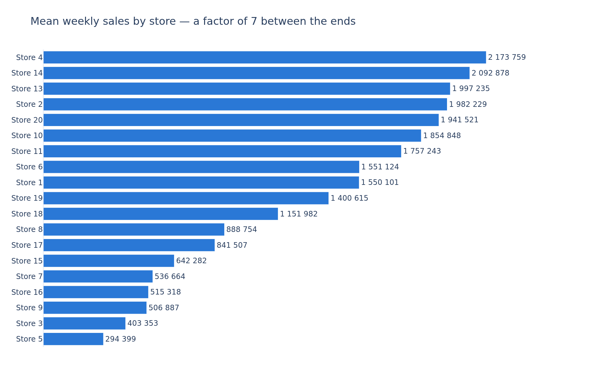
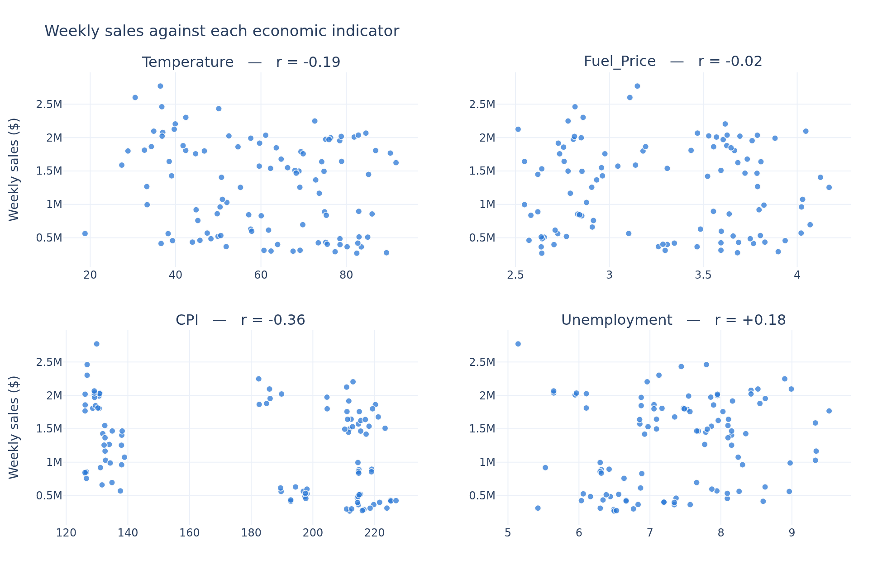
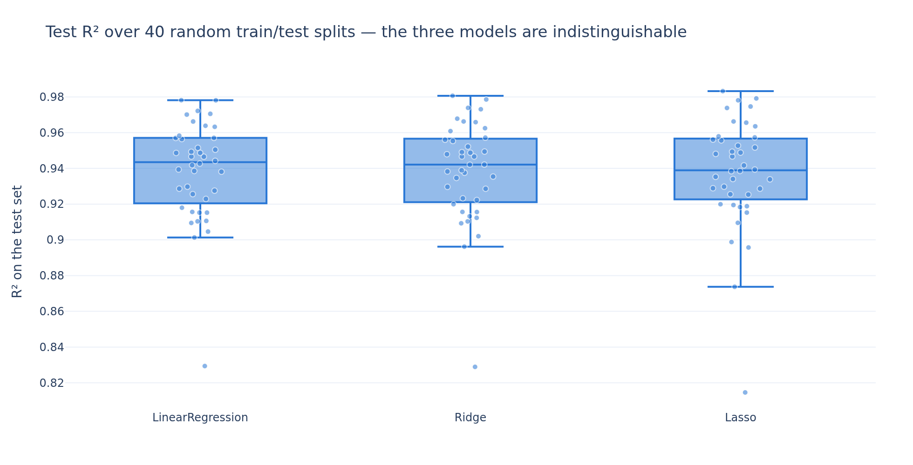

# What actually moves Walmart's weekly sales?

A weekly-sales model built for Walmart's marketing service, who wanted to plan campaigns around
economic indicators.

Jedha *Full Stack Data Scientist* — **Block 3, Machine Learning Project**. scikit-learn.

The full analysis, with every cleaning rule and its measured cost, is in
[`walmart_project.ipynb`](walmart_project.ipynb).

## The problem

Marketing believes weekly sales follow the economy — fuel price, unemployment, the consumer price
index — and asked for a linear regression that predicts sales from those variables, so that
campaigns can be planned around their movements.

The model was built as asked. It reaches **R² = 0.93 on unseen weeks**, and the answer to the
question behind the brief is still no:

> The model is accurate, and almost none of its accuracy comes from the economy.
> It comes from knowing **which store** the week belongs to.

## The dataset

`Walmart_Store_sales.csv` — 150 rows, one per store-week, 20 stores, February 2010 to October
2012. A custom extract from the Kaggle Walmart competition, deliberately perforated: **half the
rows have at least one missing value**, spread evenly across seven of the eight columns at 8-12%
each — `Store` is the only one with nothing missing. Only 75 rows are complete, so `dropna()` on
the table is not an option and every column is handled by what it is.

The four preprocessing rules the brief imposes leave **113 usable rows over 19 stores**, and two of
them cost more than they look — see below.

## What we found

### The store is the model

Mean weekly sales run from **294 k$ (store 5) to 2.17 M$ (store 4)**, a factor of 7 — three
quarters of the entire spread of the target. Cross-validating one feature group at a time settles
what the model is actually using:

| features | CV R² |
|---|---|
| everything | **0.934** |
| **Store alone** | **0.929** |
| the 4 economic indicators alone | 0.034 |
| the 4 date features alone | −0.144 |
| Holiday_Flag alone | −0.133 |
| **everything EXCEPT Store** | **−0.150** |

The store number alone reaches 0.929; every other column together adds half a point. And a model
given every variable the marketing service cares about, denied only the store number, scores
**−0.150** — worse than predicting the same average for every week of every store.

In the fitted model the same thing shows up in the coefficients: the store dummies run from
**−1.28 M$ to +0.68 M$**, while everything else fits between −53 k$ and +88 k$.



### CPI is not an economic variable here, it is a store attribute

`CPI` has the strongest correlation with sales (**−0.36**) and the largest non-store coefficient,
which makes it look like the one indicator that works. **99.4% of its variance separates stores
rather than weeks**: a store's index is a constant it carries, moving 6.3 points across two and a
half years against a 101-point range across the file. A CPI is a regional price index, so the
split is presumably geographic — the file carries no location column to confirm it. Its scatter
plot gives it away — three separate clusters of stores with empty space between them.

`Unemployment` has the same problem at 75%. Only `Temperature` (35%) and `Fuel_Price` (23%) are
genuinely week-to-week quantities, and neither correlates with sales.



### There was no overfitting to fight

27 features on 90 training rows should overfit, and part 3 of the brief asks for a regularised
model to fix it. Tuned by `GridSearchCV`, **Ridge picks alpha = 0.10 out of a grid running to
10 000** — cross-validation was offered seven orders of magnitude of regularisation and asked for
none.

Repeating the whole comparison over 40 random splits shows why that is the right answer rather than
a failure: the three models average **0.939, 0.938 and 0.937**, and each one's own spread (0.82 to
0.98, standard deviation 0.03) is more than ten times the 0.002 that separates their means. Any
single split's ranking is noise.



The reason is the previous section: 18 of the 27 features are store dummies, and a store dummy is
close to a direct measurement of the answer rather than a noisy proxy a small sample might fit by
accident. There is little spurious structure available to memorise.

### Two of the brief's own rules are expensive

- **The ±3σ outlier filter deletes a store.** The only outliers in the four columns are five
  `Unemployment` values above 12.7% — and they are all store 12, which is every row store 12 has.
  The rule removes a store whose unemployment rate is high in every one of its weeks, *because*
  that store is unusual, not because anything was mismeasured. 20 stores become 19.
- **`DayOfWeek` cannot carry information.** Every week in the file is dated on a Friday, so the
  fourth date feature the brief asks for has zero variance. It is kept as a live demonstration: its
  coefficient comes out at exactly `0`, and Lasso drops it first.

Separately, dropping the 18 rows with no date cost 13% of the sample. A median year or month is not
a plausible date for anything, so the rows went rather than be invented.

## What we told the marketing service

The model can size what a given store should take in a given week — 152 k$ of average error against
585 k$ for predicting the mean. That holds for the 19 stores in the file and for no other: hold out
whole stores instead of scattered weeks and the same model scores −0.877, because everything it
knows is which store the week belongs to. It cannot tell them that a fuel-price or unemployment
move will shift sales, and **that is a property of the file, not a failure of the model**: 113
weeks over 19 stores is about six observations per store across two and a half years, and
slow-moving indicators cannot be seen through a ±675 k$ spread on six points. The full Kaggle
dataset this extract comes from has 45 stores × 143 weeks — 6 400 rows against 113 — and that is
where a defensible answer about the economy would have to come from.

## Running it

```bash
python3 -m venv .venv
.venv/bin/pip install -r requirements.txt
```

Then open `walmart_project.ipynb` and select the `.venv` kernel. The notebook reads only
`Walmart_Store_sales.csv` — no API call, no credential and no network access anywhere in this
project.

Charts render as static images so the notebook stays readable on GitHub; the same PNGs are written
to `images/`. If `kaleido` cannot find a browser, run `.venv/bin/plotly_get_chrome`.

Everything is seeded — `RANDOM_STATE = 42` throughout, seeds 0 to 39 for the 40-split study — so a
re-run reproduces every number above. That 40-split comparison in section 5 makes about 8 700
model fits and takes about a minute; every other cell is instant.

## Layout

```
walmart_project.ipynb      the analysis — sections 1 to 6
Walmart_Store_sales.csv    the dataset, 150 rows
images/                    the five charts, also embedded in the notebook
requirements.txt           pinned versions
```
